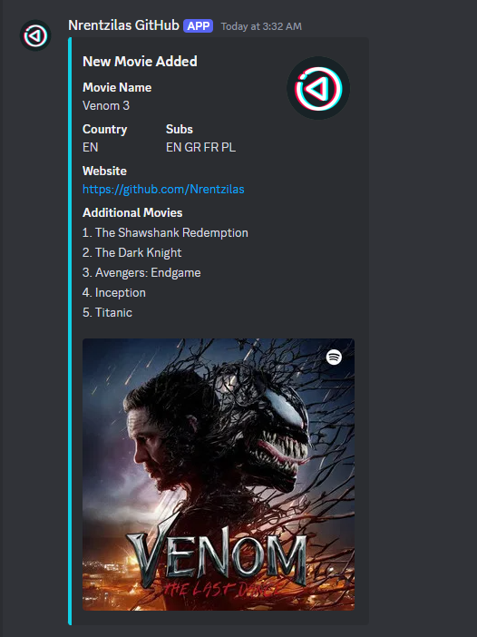

# Discord Webhook Announcer

A simple and elegant application with Graphic UI for easy use to send Discord Embed Announcements to a Discord channel via webhook. Fully customizable through the .env file

---

## Features

- **User-Friendly Interface**: Built with PyQt6 for quick and simple GUI
- **Dynamic Configurations**: Easily customize the UI (For your own usagebility) and webhook settings using a `.env` file.
- **Send Announcements**: Push structured announcements to Discord channels.
- **Customizable Fields**: Configure titles and inputs for movies, series, and additional details.

---

## Screenshots


---

## Requirements

1. **Python Version**: `3.8` or higher.
2. **Required Python Packages**:
   - `PyQt6`
   - `python-dotenv`
   - `requests`

Install dependencies using the following command:
```bash
pip install -r requirements.txt
```

---

## Installation

1. **Clone the repository**:
   ```bash
   git clone https://github.com/Nrentzilas/Discord-Webhook-Announcer.git
   cd Discord-Webhook-Announcer
   ```

2. **Create a Virtual Environment** (recommended):
   ```bash
   python -m venv venv
   source venv/bin/activate  # On Windows: venv\Scripts\activate
   ```

3. **Install Dependencies**:
   ```bash
   pip install -r requirements.txt
   ```

4. **Setup `.env` File**:
   Create a `.env` file in the root directory and configure the following variables:
   ```env
   # ------------ EXAMPLE USAGE LIKE PHOTO 1 ---------------

   # UI Configuration
   UI_TITLE=Discord Webhook Announcer

   # Embed Configuration 
   WEBHOOK_URL=https://discord.com/api/webhooks/BLAH BLAH BLAH BLAH 
   AUTHOR_IMAGE_URL= IMAGE HOSTED ONLINE ( CHECK IMG BB )

   # Ui & Embed Configuration    

   #  ---  Note that by changing these values, you change them both on UI & on the embed ---
   #  ---          I made it this way so it is easier for long-term usage                ---

   TITLE1=New Movie Added
   FIELD1_TITLE=Movie Name
   INLINE1_TITLE=Country
   INLINE2_TITLE=Subs
   # --- The Field3 is the field with the link | Maybe a link on a website or anything you like ---
   FIELD3_TITLE=Website
   FIELD4_TITLE=Additional Movies
   ```

5. **Run the Application**:
   ```bash
   python discord_movie_bot.py
   ```

---

## Building an Executable

If you want to distribute the application as an executable, follow these steps:

1. **Install PyInstaller**:
   ```bash
   pip install pyinstaller
   ```

2. **Build the Executable**:
   ```bash
   pyinstaller --onefile --noconsole --add-data "assets;assets" --icon=assets/logo.ico discord_movie_bot.py
   ```

3. The executable will be available in the `dist` folder.

---

## Folder Structure
```
project-root/
├── assets/
│   ├── logo.ico
│   ├── screenshot.png
├── discord_movie_bot.py
├── requirements.txt
├── .env
├── README.md
```

---

## Contributing

Contributions are welcome! Feel free to fork the repository and submit pull requests.

---

## License

This project is licensed under the MIT License. See the `LICENSE` file for details.

---

## Support

For any issues, feel free to open an issue on the [GitHub repository](https://github.com/Nrentzilas/Discord-Webhook-Announcer.git) or contact me directly at Discord: sparkmate
